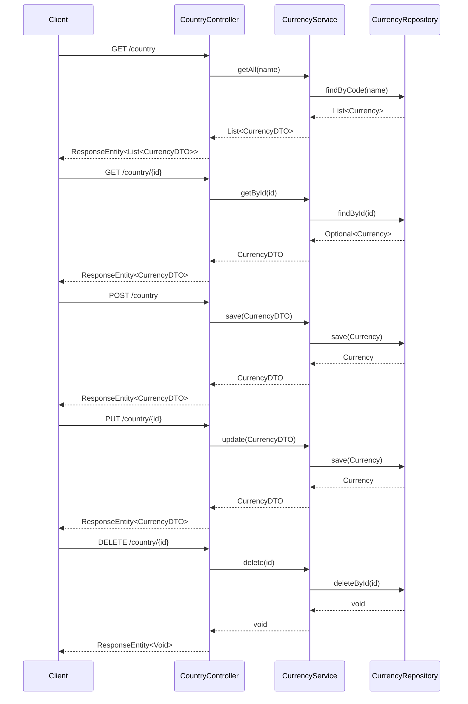
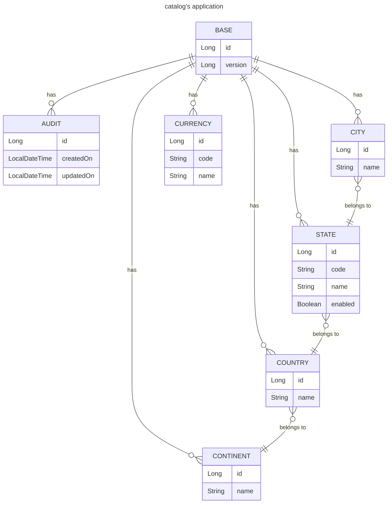
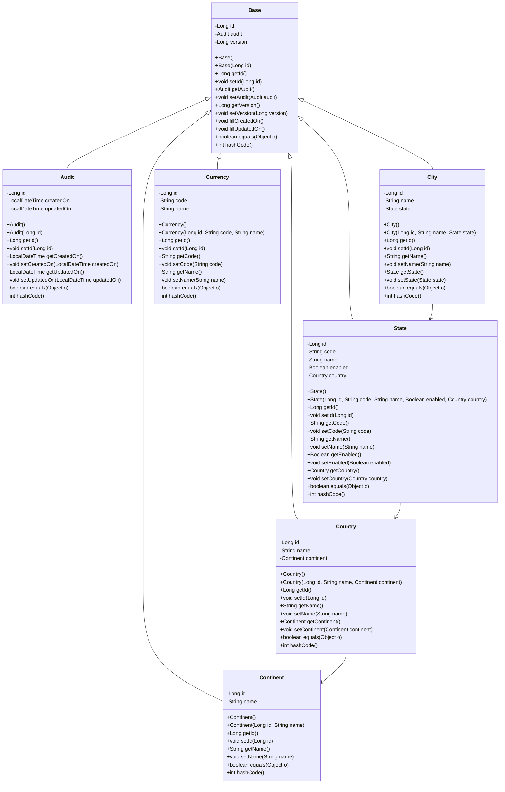

# Test
* http://localhost:8080/api/catalog/country/1
* http://localhost:8080/api/catalog/country/2
* http://localhost:5050/browser/
# Sequence Diagrams

# Entity Relationship Diagrams

# Class Diagram
